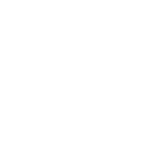

    

<h1 align="center">
  Personal Website
</h1>

## Intro

The purpose of this website is twofold:
1. Build a site which includes info about me and allows people to get to know me a little better than through my LinkedIn page while showcasing future projects and blogs where I keep my thoughts organized.
2. Get some familiarity back with tech stacks that I haven't used for some years as well as learn them in a little more depth. I took this chance to get familiar with Gatsby since I've not used it before.

I plan to make a Gatsby starter out of this in the future, but will wait until I'm satisfied with the state of it (including more automation and ease of use) before making one.

## Roadmap

I plan to include a more structured roadmap in the future, but this is my current list of goals for the site:
### Landing Page
- [x]  Picture
- [x]  About section styling
- [ ]  Better alignment
### Resume
- [x]  Timeline nodes correct margins
- [ ]  Icons on timeline instead of nodes
- [x]  Text animation on timeline
- [x]  Theme icon + animation
- [x]  Download pdf resume
  - [ ]  Create updated pdf resume
- [ ]  Test using horizontal sliders for the diferrent sections - specifically for the experience and projects section.

### Projects
- [x]  Add project cards
- [x]  Link card click to GitHub
- [x]  Bring into focus on hover (bigger and blur others)

### Blog
- [ ] Create blog format
- [ ] Use Notion API to fetch blogs from personal workspace based on list or cron job
- [ ] Create blog cards
- [ ] Create blog layout
- [ ] Write blogs!
### Overall
- [x]  Add keys to any element arrays
- [ ]  Optimize icon usage
    - [ ]  Dark mode only has dark mode icons insead of pulling shared icons twice
    - [x]  Create icons statically
- [x]  Optimize fonts
- [ ]  Optimize seo
- [x]  Optimize rendering
- [x]  Themify everything
  - [x]  Fonts
  - [x]  Icons
  - [x]  Buttons
  - [x]  Links
  - [x]  Nav
  - [x]  Theme colors
  - [x]  Transitions
- [ ]  Responsiveness
  - [x]  Landing page
  - [x]  Resume
  - [x]  Projects
  - [x]  Contact
  - [ ]  Blogs - Not done since blog section is still not done.